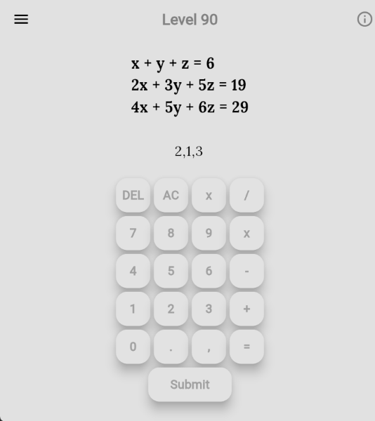
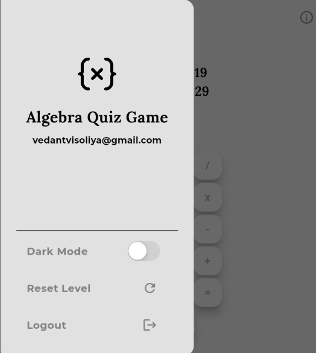

# 📐 Algebra Quiz Web App

An educational Flutter-based quiz app that helps users master linear equations through gamified levels ranging from easy one-variable equations to challenging three-variable systems.

## 🚀 Features

    🎮 90 Levels – Progress from basic to complex equations (1-variable to 3-variable).

    🔢 Custom Calculator UI – A clean, intuitive on-screen keyboard for inputs.

    🌗 Dark Mode – Switch between light and dark themes.

    📈 Level Progress Tracking – Tracks and stores your current level.

    🧮 Detailed Solutions – Every question comes with a step-by-step solution.

    🔄 Reset Progress – Option to reset and start again from Level 1.

    🔐 Firebase Authentication – Secure Email/Password login & sign-up.

    📧 Custom OTP Verification – Built using Python, FastAPI & Gmail SMTP.

    ☁️ Firestore – Stores user-specific level progress.

    📦 Hive – Efficient local data storage for performance and offline capability.

## 🔧 Tech Stack

| Layer         | Tech                                                                              |
| ------------- | --------------------------------------------------------------------------------- |
| Frontend      | [Flutter](https://flutter.dev/)                                                   |
| Auth          | [Firebase Authentication](https://firebase.google.com/products/auth)              |
| OTP Backend   | [Python](https://www.python.org/), [FastAPI](https://fastapi.tiangolo.com/), SMTP |
| Backend DB    | [Firestore](https://firebase.google.com/products/firestore)                       |
| Local Storage | Hive.                                                                             |

### 🔐 Login & Signup

Firebase Email/Password with custom OTP verification

### 📊 Quiz Interface

Solve progressively difficult linear equations using an in-app keypad.

### ☰ Navigation Drawer

Includes user email, dark mode toggle, reset button, and logout.

## 🛠 Setup Instructions

### Flutter App

1. Clone the repository:

   ```bash
   git clone https://github.com/vedantvisoliya/Flutter-Algebra-Quiz-App.git

   cd math_quiz_game
   ```

2. Get dependencies:

   ```bash
   flutter pub get
   ```

3. Configure Firebase.

4. Run the App:

   ```bash
   flutter run -d chrome
   ```

## OTP Verification Backend

1. Go to server folder.

2. Install Dependencies and Activate virtual environment:

   ```bash
   pip install -r requirements.txt
   .\venv\scripts\activate.ps1 # windows
   ```

3. Run FastAPI:

   ```bash
   fastapi dev main.py
   ```

## 🔐 API Keys & Config

You will need to add your own API keys for:

```
Gmail SMTP
```

Create a .env file in server folder and add your api keys.

```
SMTP_GMAIL_APP_KEY="YOUR_API_KEY"
```

## 📚 Educational Value

This app is designed to:

    Reinforce linear algebra concepts step-by-step

    Provide practice from beginner to advanced

    Serve as a tool for classroom or self-paced learning

## 📸 Screenshots




## 🤝 Contributing

Pull requests and feedback are welcome! Open an issue or suggest improvements.
